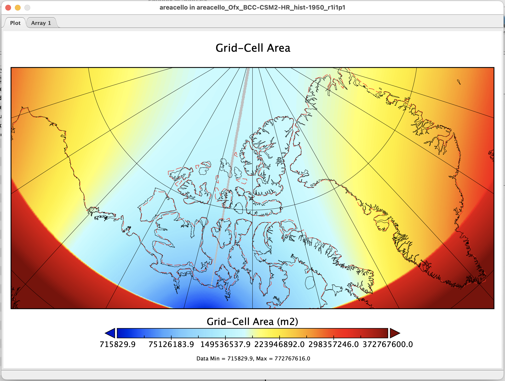
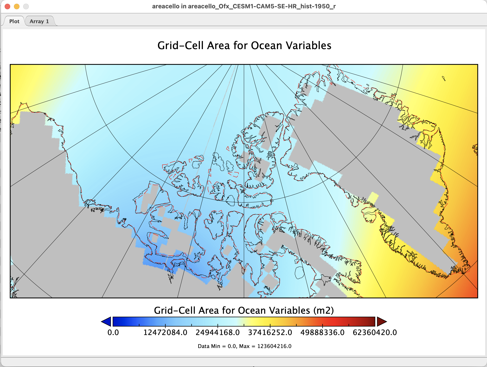
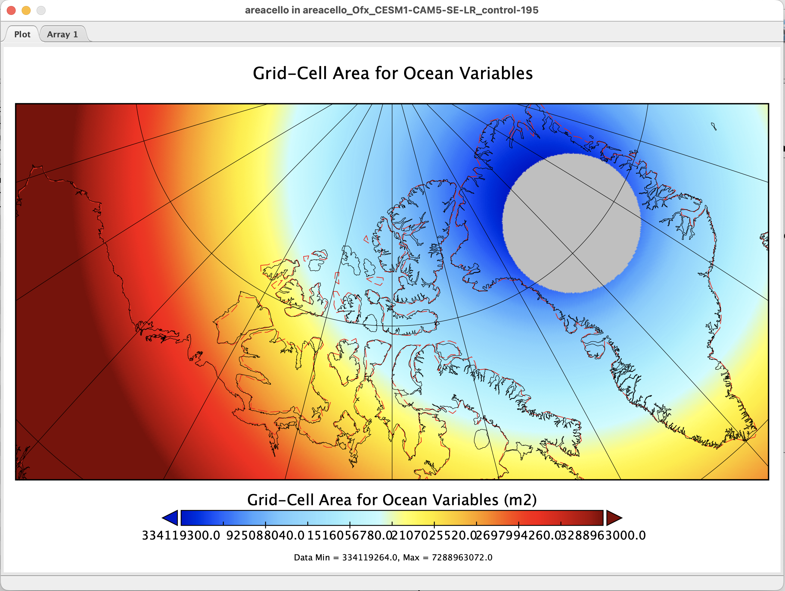
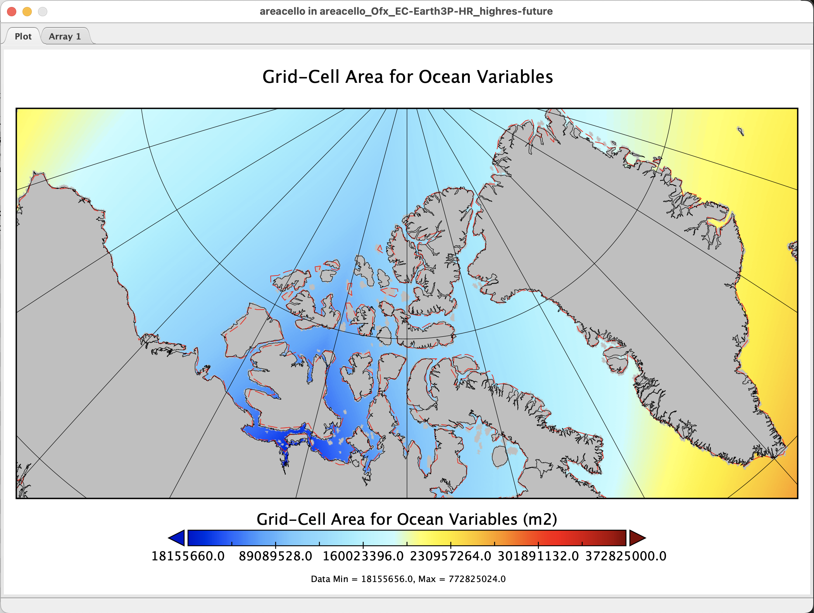

# HighResMIP Choices

In this project, we will use data from high-resolution models that participate in HighResMIP.
From the [HighResMIP website](https://highresmip.org/):
> "HighResMIP is a multi-model investigation of the impact of horizontal resolution on climate models. It involves atmosphere-only and coupled runs for 1950-2050, with some additional experiments and a successor project, HighResMIP2."

## Contents

- [Table of HighResMIP models](#model_table)
- [Model selection criteria](#selection_criteria)
- [Models](#models)
    - [AWI-CM](#AWI-CM)
        - [AWI-CM-HR](#AWI-CM-HR)
        - [AWI-CM-LR](#AWI-CM-LR)
    - [BCC-CSM2](#BCC-CSM2)
        - [BCC-CSM2-HR](#BCC-CSM2-HR)
    - [BESM](#BESM)
    - [CAM5](#CAM5)
        - [CESM1-CAM5-SE-HR](#CESM1-CAM5-SE-HR)
        - [CESM1-CAM5-SE-LR](#CESM1-CAM5-SE-LR)
    - [CAM6](#CAM6)
    - [CMCC](#CMCC)
        - [CMCC-CM2-HR4](#CMCC-CM2-HR4)
        - [CMCC-CM2-VHR4](#CMCC-CM2-VHR4)
    - [CNRM](#CNRM)
        - [CNRM-CM6-1](#CNRM-CM6-1)
        - [CNRM-CM6-1-HR](#CNRM-CM6-1-HR)
    - [EC-Earth](#EC-Earth)
        - [EC-Earth3P-HR](#EC-Earth3P-HR)
    - [FGOALS](#FGOALS)
        - [FGOALS-f3-H](#FGOALS-f3-H)
        - [FGOALS-f3-L](#FGOALS-f3-L)
    - [GFDL](#GFDL)
        - [GFDL-CM4C192](#GFDL-CM4C192)
    - [HadGEM3-GC3](#HadGEM3-GC3)
        - [HadGEM3-GC3.1-HH](#HadGEM3-GC3.1-HH)
        - [HadGEM3-GC3.1-HM](#HadGEM3-GC3.1-HM)
        - [HadGEM3-GC3.1-MM](#HadGEM3-GC3.1-MM)
    - [IPSL-CM6A](#IPSL-CM6A)
    - [MPAS-CAM](#MPAS-CAM)
        - [CAM-MPAS-HR](#CAM-MPAS-HR)
        - [CAM-MPAS-LR](#CAM-MPAS-LR)
- [References](#references)

---

[back to top](#top)

## Table of HighResMIP models

The following table is adapted from Haarsma et al. 2016[^Haarsma2016]. 
<!-- "Appendix A: Participating models in HighResMIP.  Table A1. Model details from groups expressing intention to participate in at least Tier 1 simulations, together with the potential model resolutions (if known/available, blank if not)." [^Haarsma2016] (on page 16 / 4200) -->

| Model name | Contact institute | Atmosphere resolution (STD/HI)  mid-latitude (km) | Ocean resolution  (HI) |
| --- | --- | --- | --- |
| [AWI-CM](#AWI-CM) | Alfred Wegener Institute | T127 ($∼100$ km)  T255 ($∼ 50$ km) | 1–$\frac{1}{4}^\circ$  0.05–1$^\circ$ |
| [BCC-CSM2-HR](#BCC-CSM2-HR) | Beijing Climate Center | T106 ($∼ 110$ km)  T266 ($∼ 45$ km) | $\frac{1}{3}$–1$^\circ$ |
| [BESM](#BESM) | INPE | T126 ($∼ 100$ km)  T233 ($∼ 60$ km) | 0.25$^\circ$ | 
| [CAM5](#CAM5) | Lawrence Berkeley National Laboratory | 100 km  25 km | |
| [CAM6](#CAM6) | NCAR | 100 km  28 km | |
| [CMCC](#CMCC) | Centro Euro-Mediterraneo sui  Cambiamenti Climatici | 100 km  25 km | 0.25$^\circ$ |
| [CNRM-CM6](#CNRM-CM6) | CERFACS | T127 ($∼ 100$ km)  T359 ($∼ 35$ km) | 1$^\circ$  0.25$^\circ$ |
| [EC-Earth](#EC-Earth) | SMHI, KNMI, BSC, CNR, and 23 other  institutes | T255 ($∼ 80$ km)  T511/T799 ($∼ 40$/25 km) | 1$^\circ$  0.25$^\circ$ |
| [FGOALS](#FGOALS) | LASG, IAP, CAS | 100 km  25 km | 0.1–0.25$^\circ$ | |
| [GFDL](#GFDL) | GFDL | 200 km  - | |
| [INMCM-5H](#INM-CM-5H) | Institute of Numerical Mathematics | –  0.3 $\times$ 0.4$^\circ$ | 0.25 $\times$ 0.5$\circ$  $\frac{1}{6}\times\frac{1}{8}^\circ$ |
| [IPSL-CM6](#IPSL-CM6A) | IPSL | 0.25$^\circ$ | |
| [MPAS-CAM](#MPAS-CAM) | Pacific Northwest National Laboratory | –  30–50 km | 0.25$^\circ$ | 
| MIROC6-CGCM | AORI, Univ. of Tokyo/JAMSTEC/National  Institute for Environmental Studies (NIES) | –  T213 | 0.25$^\circ$ | 
| NICAM | JAMSTEC/AORI/ The Univ. of  Tokyo/RIKEN/AICS | 56–28 km  14 km (short term) | |
| MPI-ESM | Max Planck Institute for Meteorology | T127 ($∼ 100$ km)  T255 ($∼ 50$ km) | 0.4$^\circ$ | 
| MRI-AGCM3 | Meteorological Research Institute | TL159 ($∼ 120$ km)  TL959 ($∼ 20$ km) | | 
| NorESM | Norwegian Climate Service Centre | 2$^\circ$  0.25$^\circ$ | 0.25$^\circ$ | 
| [HadGEM3-GC3](#HadGEM3-GC3) | Met Office Hadley Centre | 60 km  25 km | 0.25$^\circ$ |

---

[back to top](#top)

## Model selection criteria

<!-- > "We use data from four high‐resolution coupled climate models (Table S1 in Supporting Information S1) participating in HighResMIP (Haarsma et al. 2016[^Haarsma2016]), a MIP endorsed by CMIP6 (Eyring et al., 2016). The model data cover the period 1950–2050, corresponding to the hist‐1950 experiment with historic forcing from 1950 to 2014 and the highres‐future experiment with SSP5‐8.5 forcing from 2015 to 2050 (Haarsma et al. 2016[^Haarsma2016]). The model variables we use are described in the Sea Ice Model Intercomparison Project (SIMIP, Notz et al. 2016); they include sea ice concentration (SIMIP variable `siconc`), sea ice volume per area of the grid cell (`sivol`; hereafter ice thickness), sea ice velocity components (`siu` and `siv`) and near‐surface air temperature (`tas`). For all variables we use monthly data, except for sea ice velocity components for which we use daily data." [^Saenko2025] (on page 2) -->

In his paper, Oleg Saenko outlined the selection criteria for that project:

> "When selecting the models we applied the following criteria: (a) ocean nominal resolution must be 0.25$^\circ$ or higher; (b) model output must be available from the hist‐1950 and highres‐future simulations for all variables required in our analysis; (c) the selected models must be able to reproduce the observed trend in Arctic sea ice area within no more than two standard errors, as documented in Table 3 of Selivanova et al. (2024). The models satisfying these criteria are dominated by the HadGEM3‐GC3.1 family of models with different ocean and/or atmosphere resolution (Table S1 in Supporting Information S1)." [^Saenko2025] (on page 2) 

The selected models are summarized in the supplementary information.

> "Table S1. Climate models from HighResMIP analyzed in this study. Also indicated are the  corresponding Arctic Ocean and (nominal) atmosphere resolutions (both in km).
> 
> | Model | Modelling center | Arctic Ocean | Atmos. | Reference |
> | --- | --- | --- | --- | --- |
> | EC-Earth3P-HR | EC-Earth Consortium,  Europe | 12.6 | 50 | Haarsma et al. 2016[^Haarsma2016] |
> | HadGEM3-GC3.1-HH  HadGEM3-GC3.1-HM  HadGEM3-GC3.1-MM | Met Office Hadley Centre,  United Kingdom | 4.2  12.6  12.6 | 50  50  100 | Roberts et al. 2019[^Roberts2019] |
> 
> " [^Saenko2025] (on page 19 / X-9)

I will evaluate the HighResMIP models using similar criteria:
- Does the model have both historical and future simulation output available?
    - Historical: `hist-1950`
        - Required.
    - Future: `highres-future`
        - Not strictly required, depending on whether we make projections or solely compare to observations. 
- Does the model have the necessary variables output?
    - Priority variables: `siconc`, `siage`, `siu`, `siv`, `tas`
    - Probably won't need `sivol` is we are focusing on area fluxes.
    - Likely won't need `tas` unless we want to evaluate correlations between temperature and sea ice variables, following Saenko et al. 2025[^Saenko2025].
- Does the model have a high enough resolution?
    - We will evaluate the resolution in the CAA region in particular. 
    - Ocean resolution of 0.25$^\circ$ or higher
    - Should there be an atmosphere resolution requirement as well?
- Does the model reproduce the observed trend in Arctic sea ice area within no more than two standard errors?
    - See Selivanova et al. 2024[^Selivanova2024] Table 3 for observed trend and standard error.
- Does the model resolve the Canadian Arctic Archipelago (CAA) well?
    - How can I quantitatively evaluate this?
    - What specific channels would be necessary to resolve for this project?

---

[back to top](#top)

## Models

Evaluation of each HighResMIP model is presented below with the following information:
- Citation of the model
- Institution
- Simulations available (historical and future)
- Relevant variables available
- Resolution information
    - Ocean and atmosphere resolution
- Evaluation of how well the model reproduces the observed trend in Arctic sea ice area
- Evaluation of how well the model resolves the CAA
    - Plot of `areacello` the CAA in Panoply using these settings:
        - Map Projection
            - Projection: Azimuthal Equal-Area
            - Centered on:
                - Lon: -90$^\circ$E
                - Lat: 77$^\circ$N
                - Edge Angle: 11.0$^\circ$
                - Fill corners: Yes
            - Grid Lines Spacing:
                - 15$^\circ$ E-W
                - 15$^\circ$ N-S
        - Map Overlay
            - Overlay 1: `Earth.cno`
                - Color: Red
                - Weight: 75
                - Style: Long Dashes
            - Overlay 2: `MWDB_Coasts_1.cnob`
                - Color: Black
                - Weight: 50
                - Style: Solid

---

[back to top](#top)

### AWI-CM

[back to top](#top)

#### AWI-CM-HR

- Citation of the model
    - Semmler, Tido; Danilov, Sergey; Rackow, Thomas; Sidorenko, Dmitry; Hegewald, Jan; Sein, Dmitri; Wang, Qiang; Jung, Thomas (2017). AWI AWI-CM 1.1 HR model output prepared for CMIP6 HighResMIP. Version YYYYMMDD[1].Earth System Grid Federation. <doi:10.22033/ESGF/CMIP6.1202>
- Institution
    - Alfred Wegener Institute (AWI), Germany
- Simulations available (`experiment_id`'s)
    - `hist-1950`
    - `control-1950`
    - `spinup-1950`
- Relevant variables available
    - `realm` = `seaIce`
        - `sithick`
        - `siu`
        - `siv`
        - `sitimefrac`
        - `fsitherm`
        - `siconc`
        - `sifllatstop`
        - `siarean`
        - `siareas`
        - `sidmassevapsubl`
        - `sidmasssi`
        - `sidmassth`
        - `siextentn`
        - `siextents`
        - `sisnconc`
        - `sisnmass`
        - `sisnthick`
        - `sispeed`
        - `sistrxdtop`
        - `sistrxubot`
        - `sistrydtop`
        - `sistryubot`
        - `sivol`
        - `sivoln`
        - `sivols`
    - `tas` not available
- Resolution information
    - Ocean and atmosphere resolution
- Evaluation of how well the model reproduces the observed trend in Arctic sea ice area
- Evaluation of how well the model resolves the CAA
    - The `areacello` variable in the file for AWI-CM-HR is 1-dimensional and does not appear to map to ocean grid cells. I am unsure whether this is expected, or whether this is an issue with the data file I downloaded.

[back to top](#top)

#### AWI-CM-LR

- Citation of the model
    - Semmler, Tido; Danilov, Sergey; Rackow, Thomas; Sidorenko, Dmitry; Hegewald, Jan; Sein, Dmitri; Wang, Qiang; Jung, Thomas (2017). AWI AWI-CM 1.1 LR model output prepared for CMIP6 HighResMIP. Version YYYYMMDD.Earth System Grid Federation. <doi:10.22033/ESGF/CMIP6.1209>
- Institution
    - Alfred Wegener Institute (AWI), Germany
- Simulations available (`experiment_id`'s)
    - `hist-1950`
    - `control-1950`
    - `spinup-1950`
- Relevant variables available
    - `realm` = `seaIce`
        - `sitimefrac`
        - `sithick`
        - `siu`
        - `siv`
        - `sivoln`
        - `sivols`
        - `fsitherm`
        - `siarean`
        - `siareas`
        - `siconc`
        - `sidmassevapsubl`
        - `sidmasssi`
        - `sidmassth`
        - `siextentn`
        - `siextents`
        - `sifllatstop`
        - `sisnconc`
        - `sisnmass`
        - `sisnthick`
        - `sispeed`
        - `sistrxdtop`
        - `sistrxubot`
        - `sistrydtop`
        - `sistryubot`
        - `sivol`
    - `tas` not available
- Resolution information
    - Ocean and atmosphere resolution
- Evaluation of how well the model reproduces the observed trend in Arctic sea ice area
- Evaluation of how well the model resolves the CAA
    - The `areacello` variable in the file for AWI-CM-LR is 1-dimensional and does not appear to map to ocean grid cells. I am unsure whether this is expected, or whether this is an issue with the data file I downloaded.

---

[back to top](#top)

### BCC-CSM2

[back to top](#top)

#### BCC-CSM2-HR

- Citation of the model
    - Wu, T., Yu, R., Lu, Y., Jie, W., Fang, Y., Zhang, J., Zhang, L., Xin, X., Li, L., Wang, Z., Liu, Y., Zhang, F., Wu, F., Chu, M., Li, J., Li, W., Zhang, Y., Shi, X., Zhou, W., Yao, J., Liu, X., Zhao, H., Yan, J., Wei, M., Xue, W., Huang, A., Zhang, Y., Zhang, Y., Shu, Q., and Hu, A.: BCC-CSM2-HR: a high-resolution version of the Beijing Climate Center Climate System Model, Geosci. Model Dev., 14, 2977–3006, <doi:10.5194/gmd-14-2977-2021>, 2021. 
- Institution
    - Beijing Climate Center (BCC), China
- Simulations available (`experiment_id`'s)
    - `hist-1950`
    - `control-1950`
    - `highresSST-present`
- Relevant variables available
    - `realm` = `seaIce`
        - `siconc`
        - `siu`
        - `siv`
        - `simass`
        - `sisnthick`
        - `sitemptop`
        - `sivol`
        - `siitdconc`
        - `sithick`
    - `tas` not available
- Resolution information
    - Ocean and atmosphere resolution
- Evaluation of how well the model reproduces the observed trend in Arctic sea ice area
- Evaluation of how well the model resolves the CAA
    - In the plot below of `areacello` in Panoply, I don't see any land mask (which would be in gray), so it appears that the model does not resolve the CAA at all. 
    - Additionally, there is a gray line along approximately the 100$^\circ$E line of longitude. This line appears to be an artifact, however it is unclear to me whether this would be an artifact in the model data or an artifact of plotting it in Panoply.

---

[back to top](#top)

### BESM

I do not see this model as available through the ESGF data portal.
Here's a citation I found for something related: Veiga, S. F., Nobre, P., Giarolla, E., Capistrano, V., Baptista Jr., M., Marquez, A. L., Figueroa, S. N., Bonatti, J. P., Kubota, P., and Nobre, C. A.: The Brazilian Earth System Model ocean–atmosphere (BESM-OA) version 2.5: evaluation of its CMIP5 historical simulation, Geosci. Model Dev., 12, 1613–1642, <doi:10.5194/gmd-12-1613-2019>, 2019. 

---

[back to top](#top)

### CAM5

[back to top](#top)

#### CESM1-CAM5-SE-HR

- Citation of the model
    - Hurrel, James; Holland, Marika; Gent, Peter; Ghan, Steven; Kay, Jennifer; Kushner, Paul; Lamarque, Jean-Francois; Large, William G.; Lawrence, David; Lindsay, Keith; Lipscomb, William; Long, Matthew; Mahowald, Natalie M.; Marsh, Daniel; Neale, Richard; Rasch, Philip J.; Vavrus, Stephen J.; Vertenstein, Mariana; Bader, David C.; Collins, William D.; Hack, James J.; Kiehl, Jeff; Marshall, Shawn (2020). NCAR CESM1-CAM5-SE-HR model output prepared for CMIP6 HighResMIP. Version YYYYMMDD.Earth System Grid Federation. <doi:10.22033/ESGF/CMIP6.14220>
- Institution
    - National Center for Atmospheric Research (NCAR), United States
- Simulations available (`experiment_id`'s)
    - `highres-future`
    - `hist-1950`
    - `control-1950`
- Relevant variables available
    - `realm` = `seaIce`
        - `sfdsi`
        - `siage`
        - `siarean`
        - `siareas`
        - `sicompstren`
        - `siconc`
        - `sidconcdyn`
        - `sidconcth`
        - `sidivvel`
        - `sidmasstranx`
        - `sidmasstrany`
        - `siextentn`
        - `siextents`
        - `sifllatstop`
        - `sifllwdtop`
        - `sifllwutop`
        - `siflsenstop`
        - `siflsensupbot`
        - `siflswdbot`
        - `siflswdtop`
        - `siflswutop`
        - `siforcecoriolx`
        - `siforcecorioly`
        - `siforceintstrx`
        - `siforceintstry`
        - `simass`
        - `sisaltmass`
        - `sishevel`
        - `sisnthick`
        - `sispeed`
        - `sistrxdtop`
        - `sistrxubot`
        - `sistrydtop`
        - `sistryubot`
        - `sitemptop`
        - `sithick`
        - `sitimefrac`
        - `siu`
        - `siv`
        - `sivol`
        - `sivoln`
        - `sivols`
        - `siconca`
    - `tas`
- Resolution information
    - Ocean and atmosphere resolution
- Evaluation of how well the model reproduces the observed trend in Arctic sea ice area
- Evaluation of how well the model resolves the CAA
    - In the plot below of `areacello` in Panoply, the model's land mask (in grey) does not appear to resolve the CAA well. The land mask is missing many islands of the CAA and the coastlines are very blocky and poorly resolved. The Parry Channel is clear, however lacks all the islands along the northern side. 
    - Additionally, there is a gray line along approximately the 110$^\circ$E line of longitude. This line appears to be an artifact, however it is unclear to me whether this would be an artifact in the model data or an artifact of plotting it in Panoply.

[back to top](#top)

#### CESM1-CAM5-SE-LR

- Citation of the model
    - Hurrel, James; Holland, Marika; Gent, Peter; Ghan, Steven; Kay, Jennifer; Kushner, Paul; Lamarque, Jean-Francois; Large, William G.; Lawrence, David; Lindsay, Keith; Lipscomb, William; Long, Matthew; Mahowald, Natalie M.; Marsh, Daniel; Neale, Richard; Rasch, Philip J.; Vavrus, Stephen J.; Vertenstein, Mariana; Bader, David C.; Collins, William D.; Hack, James J.; Kiehl, Jeff; Marshall, Shawn (2020). NCAR CESM1-CAM5-SE-LR model output prepared for CMIP6 HighResMIP. Version YYYYMMDD.Earth System Grid Federation. <doi:10.22033/ESGF/CMIP6.14262>
- Institution
    - National Center for Atmospheric Research (NCAR), United States
- Simulations available (`experiment_id`'s)
    - `highres-future`
    - `control-1950`
- Relevant variables available
    - `realm` = `seaIce`
        - `sfdsi`
        - `siage`
        - `siarean`
        - `siareas`
        - `sicompstren`
        - `siconc`
        - `sidconcdyn`
        - `sidconcth`
        - `sidivvel`
        - `sidmasstranx`
        - `sidmasstrany`
        - `siextentn`
        - `siextents`
        - `sifllatstop`
        - `sifllwdtop`
        - `sifllwutop`
        - `siflsenstop`
        - `siflsensupbot`
        - `siflswdbot`
        - `siflswdtop`
        - `siflswutop`
        - `siforcecoriolx`
        - `siforcecorioly`
        - `siforceintstrx`
        - `siforceintstry`
        - `simass`
        - `simassacrossline`
        - `sisaltmass`
        - `sishevel`
        - `sisnthick`
        - `sispeed`
        - `sistrxdtop`
        - `sistrxubot`
        - `sistrydtop`
        - `sistryubot`
        - `sitemptop`
        - `sithick`
        - `sitimefrac`
        - `siu`
        - `siv`
        - `sivol`
        - `sivoln`
        - `sivols`
        - `siconca`
    - `tas`
- Resolution information
    - Ocean and atmosphere resolution
- Evaluation of how well the model reproduces the observed trend in Arctic sea ice area
- Evaluation of how well the model resolves the CAA
    - In the plot below of `areacello` in Panoply, the model's land mask (in grey) is very low resolution with only a "pole hole" in Greenland.
- Decision
    - Excluded from analysis due to not resolving any islands of the CAA.

---

[back to top](#top)

### CAM6

I do not see this model as available through the ESGF data portal.
Seems like this might not have been completed yet?
The webpage I found for it is out of date: https://ncar.github.io/CAM_SciDoc/doc/build/html/cam6_scientific_summary/index.html#references

---

[back to top](#top)

### CMCC

[back to top](#top)

#### CMCC-CM2-HR4

- Citation of the model
    - Scoccimarro, Enrico; Bellucci, Alessio; Peano, Daniele (2017). CMCC CMCC-CM2-HR4 model output prepared for CMIP6 HighResMIP. Version YYYYMMDD.Earth System Grid Federation. <doi:10.22033/ESGF/CMIP6.1359>
- Institution
    - Centro Euro-Mediterraneo sui Cambiamenti Climatici (CMCC), Italy
- Simulations available (`experiment_id`'s)
    - `highres-future`
    - `hist-1950`
    - `control-1950`
    - `highresSST-future`
    - `highresSST-present`
- Relevant variables available
    - `realm` = `seaIce`
        - `siconc`
        - `simass`
        - `sisnmass`
        - `sitimefrac`
        - `sivol`
    - `tas`
    - `areacello` not available
- Resolution information
    - Ocean and atmosphere resolution
- Evaluation of how well the model reproduces the observed trend in Arctic sea ice area
- Evaluation of how well the model resolves the CAA
- Decision
    - Excluded from analysis due to lack of necessary variables (e.g. `siu`, `siv`, `siage`).

[back to top](#top)

#### CMCC-CM2-VHR4

- Citation of the model
    - Scoccimarro, Enrico; Bellucci, Alessio; Peano, Daniele (2017). CMCC CMCC-CM2-VHR4 model output prepared for CMIP6 HighResMIP. Version YYYYMMDD.Earth System Grid Federation. <doi:10.22033/ESGF/CMIP6.1367>
- Institution
    - Centro Euro-Mediterraneo sui Cambiamenti Climatici (CMCC), Italy
- Simulations available (`experiment_id`'s)
    - `highres-future`
    - `hist-1950`
    - `control-1950`
    - `highresSST-future`
    - `highresSST-present`
- Relevant variables available
    - `realm` = `seaIce`
        - `siconc`
        - `simass`
        - `sisnmass`
        - `sitimefrac`
        - `sivol`
    - `tas`
    - `areacello` not available
- Resolution information
    - Ocean and atmosphere resolution
- Evaluation of how well the model reproduces the observed trend in Arctic sea ice area
- Evaluation of how well the model resolves the CAA
- Decision
    - Excluded from analysis due to lack of necessary variables (e.g. `siu`, `siv`, `siage`).

---

[back to top](#top)

### CNRM

[back to top](#top)

#### CNRM-CM6-1

- Citation of the model
    - Voldoire, A., Saint-Martin, D., Sénési, S., Decharme, B., Alias, A., Chevallier, M., et al. (2019). Evaluation of CMIP6 DECK experiments with CNRM-CM6-1. Journal of Advances in Modeling Earth Systems, 11, 2177–2213. <doi:10.1029/2019MS001683>
- Institution
    - Centre Européen de Recherche et de Formation Avancée en Calcul Scientifique (CERFACS), France
- Simulations available (`experiment_id`'s)
    - `highres-future`
    - `hist-1950`
    - `control-1950`
    - `spinup-1950`
    - `highresSST-future`
    - `highresSST-present`
- Relevant variables available
    - `realm` = `seaIce`
        - `siconca`
        - `siconc`
        - `sithick`
        - `siu`
        - `siv`
        - `sidconcdyn`
        - `simass`
        - `sitemptop`
        - `sidmasslat`
        - `siextentn`
        - `siextents`
        - `sisnconc`
        - `sisnthick`
        - `sispeed`
        - `sitempsnic`
        - `sivol`
        - `sivoln`
        - `sivols`
        - `siareaacrossline`
        - `siarean`
        - `siareas`
        - `sidconcth`
        - `sidmassgrowthbot`
        - `sidmassmeltbot`
        - `sidmassmelttop`
        - `sidmasstranx`
        - `sidmasstrany`
        - `sifb`
        - `sifllatstop`
        - `sifllwutop`
        - `siflsensupbot`
        - `siflswdtop`
        - `siflswutop`
        - `simassacrossline`
        - `sndmassmelt`
        - `sndmasssi`
        - `sndmasssnf`
        - `sfdsi`
        - `siage`
        - `sicompstren`
        - `sidmassth`
        - `sihc`
        - `sidmassdyn`
        - `sisaltmass`
        - `sisnhc`
        - `sisnmass`
        - `sistrxdtop`
        - `sitimefrac`
        - `sidivvel`
        - `sidmassevapsubl`
        - `sidmassgrowthwat`
        - `sidmasssi`
        - `siflcondbot`
        - `siflcondtop`
        - `siflfwbot`
        - `siflfwdrain`
        - `siflswdbot`
        - `sipr`
        - `sishevel`
        - `sistrxubot`
        - `sistrydtop`
        - `sistryubot`
        - `sitempbot`
        - `sndmassdyn`
        - `sndmasssubl`
        - `snmassacrossline`
    - `tas`
    - `areacello` not available
- Resolution information
    - Ocean and atmosphere resolution
- Evaluation of how well the model reproduces the observed trend in Arctic sea ice area
- Evaluation of how well the model resolves the CAA
    - This model does not appear to have `areacello` or any fixed-frequency variables available. Therefore, I have not made a map of the CAA in Panoply for this model. 

[back to top](#top)

#### CNRM-CM6-1-HR

- Citation of the model
    - Voldoire, Aurore (2019). CNRM-CERFACS CNRM-CM6-1-HR model output prepared for CMIP6 HighResMIP. Version YYYYMMDD.Earth System Grid Federation. <doi:10.22033/ESGF/CMIP6.1387>
- Institution
    - Centre Européen de Recherche et de Formation Avancée en Calcul Scientifique (CERFACS), France
- Simulations available (`experiment_id`'s)
    - `highres-future`
    - `hist-1950`
    - `control-1950`
    - `highresSST-future`
    - `highresSST-present`
- Relevant variables available
    - `realm` = `seaIce`
        - `siconc`
        - `sithick`
        - `siu`
        - `siv`
        - `sfdsi`
        - `sitempsnic`
        - `sivoln`
        - `siconca`
        - `siextentn`
        - `siextents`
        - `simass`
        - `sisnconc`
        - `sisnthick`
        - `sispeed`
        - `sitemptop`
        - `sivol`
        - `sivols`
        - `sidmassdyn`
        - `sidmassth`
        - `sihc`
        - `sisaltmass`
        - `sisnhc`
        - `sisnmass`
        - `sitimefrac`
    - `tas`
    - `areacello` not available
- Resolution information
    - Ocean and atmosphere resolution
- Evaluation of how well the model reproduces the observed trend in Arctic sea ice area
- Evaluation of how well the model resolves the CAA
    - This model does not appear to have `areacello` or any fixed-frequency variables available. Therefore, I have not made a map of the CAA in Panoply for this model. 

---

[back to top](#top)

### EC-Earth

[back to top](#top)

#### EC-Earth3P-HR

- Citation of the model
    - Haarsma, R., Acosta, M., Bakhshi, R., Bretonnière, P.-A., Caron, L.-P., Castrillo, M., Corti, S., Davini, P., Exarchou, E., Fabiano, F., Fladrich, U., Fuentes Franco, R., García-Serrano, J., von Hardenberg, J., Koenigk, T., Levine, X., Meccia, V. L., van Noije, T., van den Oord, G., Palmeiro, F. M., Rodrigo, M., Ruprich-Robert, Y., Le Sager, P., Tourigny, E., Wang, S., van Weele, M., and Wyser, K.: HighResMIP versions of EC-Earth: EC-Earth3P and EC-Earth3P-HR – description, model computational performance and basic validation, Geosci. Model Dev., 13, 3507–3527, <doi:10.5194/gmd-13-3507-2020>, 2020.
- Institution
    - EC-Earth Consortium, Europe
- Simulations available (`experiment_id`'s)
    - `highres-future`
    - `hist-1950`
    - `control-1950`
    - `highresSST-future`
    - `highresSST-present`
- Relevant variables available
    - `realm` = `seaIce`
        - `siconc`
        - `sithick`
        - `siu`
        - `siv`
        - `sitemptop`
        - `sisnthick`
        - `sispeed`
        - `siage`
        - `sicompstren`
        - `sidmassevapsubl`
        - `siflswdtop`
        - `sistrxdtop`
        - `sistrydtop`
        - `sivol`
        - `sisali`
    - `tas`
- Resolution information
    - Ocean and atmosphere resolution
- Evaluation of how well the model reproduces the observed trend in Arctic sea ice area
- Evaluation of how well the model resolves the CAA
    - In the plot below of `areacello` in Panoply, the model's land mask (in grey) appears to resolve the CAA well. The land mask matches well both the `Earth.cno` (red dashed line) and `MWDB_Coasts_1.cnob` (black solid line) overlays, which represent the coastlines of the CAA. In particular, the Parry Channel seems to be well-resolved.

---

[back to top](#top)

### FGOALS

[back to top](#top)

#### FGOALS-f3-H

- Citation of the model
    - BAO, Q., LIU, Y., WU, G., HE, B., LI, J., WANG, L., … ZHANG, X. (2020). CAS FGOALS-f3-H and CAS FGOALS-f3-L outputs for the high-resolution model intercomparison project simulation of CMIP6. Atmospheric and Oceanic Science Letters, 13(6), 576–581. <doi:10.1080/16742834.2020.1814675>
- Institution
    - Chinese Academy of Sciences (CAS), China
- Simulations available (`experiment_id`'s)
    - `highres-future`
    - `hist-1950`
    - `control-1950`
    - `highresSST-future`
    - `highresSST-present`
- Relevant variables available
    - `realm` = `seaIce`
        - None
    - `tas`
    - `areacello` not available
- Resolution information
    - Ocean and atmosphere resolution
- Evaluation of how well the model reproduces the observed trend in Arctic sea ice area
- Evaluation of how well the model resolves the CAA
- Decision
    - Excluded from analysis due to lack of necessary variables (e.g. `siconc`, `siu`, `siv`, `siage`).

[back to top](#top)

#### FGOALS-f3-L

- Citation of the model
    - BAO, Q., LIU, Y., WU, G., HE, B., LI, J., WANG, L., … ZHANG, X. (2020). CAS FGOALS-f3-H and CAS FGOALS-f3-L outputs for the high-resolution model intercomparison project simulation of CMIP6. Atmospheric and Oceanic Science Letters, 13(6), 576–581. <doi:10.1080/16742834.2020.1814675>
- Institution
    - Chinese Academy of Sciences (CAS), China
- Simulations available (`experiment_id`'s)
    - `highresSST-future`
    - `highresSST-present`
- Relevant variables available
    - `realm` = `seaIce`
        - None
    - `tas`
    - `areacello` not available
- Resolution information
    - Ocean and atmosphere resolution
- Evaluation of how well the model reproduces the observed trend in Arctic sea ice area
- Evaluation of how well the model resolves the CAA
- Decision
    - Excluded from analysis due to lack of necessary variables (e.g. `siconc`, `siu`, `siv`, `siage`).

[back to top](#top)

---
### GFDL

[back to top](#top)

#### GFDL-CM4C192

- Citation of the model
    - Zhao, Ming; Blanton, Chris; John, Jasmin G; Radhakrishnan, Aparna; Zadeh, Niki T.; McHugh, Colleen; Rand, Kristopher; Vahlenkamp, Hans; Wilson, Chandin; Ginoux, Paul; Malyshev, Sergey; Wyman, Bruce; Guo, Huan; Balaji, V; Held, Isaac M; Dunne, John P.; Winton, Michael; Adcroft, Alistair; Milly, P.C.D; Shevliakova, Elena; Knutson, Thomas; Ploshay, Jeffrey; Zeng, Yujin (2018). NOAA-GFDL GFDL-CM4C192 model output prepared for CMIP6 HighResMIP highresSST-future. Version YYYYMMDD.Earth System Grid Federation. <doi:10.22033/ESGF/CMIP6.8563>
- Institution
    - National Oceanic and Atmospheric Administration (NOAA), Geophysical Fluid Dynamics Laboratory (GFDL), United States
- Simulations available (`experiment_id`'s)
    - `hist-1950`
    - `control-1950`
    - `highresSST-future`
    - `highresSST-present`
- Relevant variables available
    - `realm` = `seaIce`
        - `siconc`
        - `simass`
        - `sisnconc`
        - `sisnmass`
        - `sisnthick`
        - `sispeed`
        - `sitemptop`
        - `sithick`
        - `sitimefrac`
        - `sivol`
        - `siu`
        - `siv`
    - `tas`
    - `areacello` not available
- Resolution information
    - Ocean and atmosphere resolution
- Evaluation of how well the model reproduces the observed trend in Arctic sea ice area
- Evaluation of how well the model resolves the CAA
    - This model does not appear to have `areacello` or any fixed-frequency variables available. Therefore, I have not made a map of the CAA in Panoply for this model.

[back to top](#top)

---
### HadGEM3-GC3

[back to top](#top)

#### HadGEM3-GC3.1-HH

- Citation of the model
    - Roberts, Malcolm (2018). MOHC HadGEM3-GC31-HH model output prepared for CMIP6 HighResMIP. Version YYYYMMDD.Earth System Grid Federation. <doi:10.22033/ESGF/CMIP6.445>
- Institution
    - Met Office Hadley Centre, United Kingdom
- Simulations available (`experiment_id`'s)
    - `highres-future`
    - `hist-1950`
    - `control-1950`
- Relevant variables available
    - `realm` = `seaIce`
        - `sithick`
        - `siu`
        - `siv`
        - `siage`
        - `siconc`
        - `sidivvel`
        - `sidmassdyn`
        - `sidmassmeltbot`
        - `sidmassmelttop`
        - `sidmassth`
        - `siflcondbot`
        - `siflcondtop`
        - `siflfwbot`
        - `siflfwdrain`
        - `sifllatstop`
        - `siflsensupbot`
        - `sihc`
        - `simass`
        - `sipr`
        - `sisnconc`
        - `sisnhc`
        - `sisnmass`
        - `sisnthick`
        - `sispeed`
        - `sistrxdtop`
        - `sistrxubot`
        - `sistrydtop`
        - `sistryubot`
        - `sitempbot`
        - `sitimefrac`
        - `sivol`
    - `tas`
- Resolution information
    - Ocean and atmosphere resolution
- Evaluation of how well the model reproduces the observed trend in Arctic sea ice area
- Evaluation of how well the model resolves the CAA
    - In the plot below of `areacello` in Panoply, the model's land mask (in grey) appears to resolve the CAA well. I suspect this might indeed be the same `areacello` as was used for EC-Earth3P-HR. The only difference I can see is a gray line along approximately the 107$^\circ$E line of longitude. This line appears to be an artifact, however it is unclear to me whether this would be an artifact in the model data or an artifact of plotting it in Panoply.

[back to top](#top)

#### HadGEM3-GC3.1-HM

- Citation of the model
    - Roberts, Malcolm (2017). MOHC HadGEM3-GC31-HM model output prepared for CMIP6 HighResMIP. Version YYYYMMDD.Earth System Grid Federation. <doi:10.22033/ESGF/CMIP6.446>
- Institution
    - Met Office Hadley Centre, United Kingdom
- Simulations available (`experiment_id`'s)
    - `highres-future`
    - `hist-1950`
    - `control-1950`
    - `highresSST-future`
    - `highresSST-present`
- Relevant variables available
    - `realm` = `seaIce`
        - `sithick`
        - `siu`
        - `siv`
        - `siage`
        - `siconc`
        - `sidivvel`
        - `sidmassdyn`
        - `sidmassmeltbot`
        - `sidmassmelttop`
        - `sidmassth`
        - `siflcondbot`
        - `siflcondtop`
        - `siflfwbot`
        - `siflfwdrain`
        - `sifllatstop`
        - `sifllwdtop`
        - `sifllwutop`
        - `siflsenstop`
        - `siflsensupbot`
        - `siflswdtop`
        - `siflswutop`
        - `sihc`
        - `simass`
        - `sipr`
        - `sisnconc`
        - `sisnhc`
        - `sisnmass`
        - `sisnthick`
        - `sispeed`
        - `sistrxdtop`
        - `sistrxubot`
        - `sistrydtop`
        - `sistryubot`
        - `sitempbot`
        - `sitemptop`
        - `sitimefrac`
        - `sivol`
    - `tas`
- Resolution information
    - Ocean and atmosphere resolution
- Evaluation of how well the model reproduces the observed trend in Arctic sea ice area
- Evaluation of how well the model resolves the CAA
    - The `areacello` plot for HadGEM3-GC3.1-HM seems to be identical to the `areacello` plot for [HadGEM3-GC3.1-HH](#HadGEM3-GC3.1-HH), and therefore I won't reproduce it here. 

[back to top](#top)

#### HadGEM3-GC3.1-MM

- Citation of the model
    - Ridley, Jeff; Menary, Matthew; Kuhlbrodt, Till; Andrews, Martin; Andrews, Tim (2019). MOHC HadGEM3-GC31-MM model output prepared for CMIP6 CMIP historical. Version YYYYMMDD.Earth System Grid Federation. <doi:10.22033/ESGF/CMIP6.6112>
- Institution
    - Met Office Hadley Centre, United Kingdom
- Simulations available (`experiment_id`'s)
    - `highres-future`
    - `hist-1950`
    - `control-1950`
    - `highresSST-future`
    - `highresSST-present`
    - `spinup-1950`
- Relevant variables available
    - `realm` = `seaIce`
        - `sithick`
        - `siu`
        - `siv`
        - `siage`
        - `siconc`
        - `sidivvel`
        - `sidmassdyn`
        - `sidmassmeltbot`
        - `sidmassmelttop`
        - `sidmassth`
        - `siflcondbot`
        - `siflcondtop`
        - `siflfwbot`
        - `siflfwdrain`
        - `sifllatstop`
        - `sifllwdtop`
        - `sifllwutop`
        - `siflsenstop`
        - `siflsensupbot`
        - `siflswdtop`
        - `siflswutop`
        - `sihc`
        - `simass`
        - `sipr`
        - `sisnconc`
        - `sisnhc`
        - `sisnmass`
        - `sisnthick`
        - `sispeed`
        - `sistrxdtop`
        - `sistrxubot`
        - `sistrydtop`
        - `sistryubot`
        - `sitempbot`
        - `sitemptop`
        - `sitimefrac`
        - `sivol`
    - `tas`
- Resolution information
    - Ocean and atmosphere resolution
- Evaluation of how well the model reproduces the observed trend in Arctic sea ice area
- Evaluation of how well the model resolves the CAA
    - The `areacello` plot for HadGEM3-GC3.1-MM seems to be identical to the `areacello` plot for [HadGEM3-GC3.1-HH](#HadGEM3-GC3.1-HH), and therefore I won't reproduce it here.
    
---

[back to top](#top)

### INM-CM

[back to top](#top)

#### INM-CM-5H

- Citation of the model
    - Volodin, Evgeny; Mortikov, Evgeny; Gritsun, Andrey; Lykossov, Vasily; Galin, Vener; Diansky, Nikolay; Gusev, Anatoly; Kostrykin, Sergey; Iakovlev, Nikolay; Shestakova, Anna; Emelina, Svetlana (2019). INM INM-CM5-0 model output prepared for CMIP6 ScenarioMIP. Version YYYYMMDD.Earth System Grid Federation. <doi:10.22033/ESGF/CMIP6.12322>
- Institution
    - Institute of Numerical Mathematics, Russian Academy of Sciences, Russia
- Simulations available (`experiment_id`'s)
    - `hist-1950`
    - `control-1950`
    - `highresSST-present`
- Relevant variables available
    - `realm` = `seaIce`
        - `siconc`
        - `simass`
    - `tas`
    - `areacello` not available
- Resolution information
    - Ocean and atmosphere resolution
- Evaluation of how well the model reproduces the observed trend in Arctic sea ice area
- Evaluation of how well the model resolves the CAA
- Decision
    - Excluded from analysis due to lack of necessary variables (e.g. `siu`, `siv`, `siage`).
    
---

[back to top](#top)

### IPSL-CM6A

- This evaluation applies to all of the following models:
    - IPSL-CM6A-ATM-ICO-LR
    - IPSL-CM6A-ATM-ICO-MR
    - IPSL-CM6A-ATM-ICO-HR
    - IPSL-CM6A-ATM-ICO-VHR
    - IPSL-CM6A-LR
    - IPSL-CM6A-ATM-HR
- Citation of one of the models (IPSL-CM6A-LR)
    - Boucher, Olivier; Denvil, Sébastien; Levavasseur, Guillaume; Cozic, Anne; Caubel, Arnaud; Foujols, Marie-Alice; Meurdesoif, Yann; Cadule, Patricia; Devilliers, Marion; Ghattas, Josefine; Lebas, Nicolas; Lurton, Thibaut; Mellul, Lidia; Musat, Ionela; Mignot, Juliette; Cheruy, Frédérique (2018). IPSL IPSL-CM6A-LR model output prepared for CMIP6 CMIP. Version YYYYMMDD.Earth System Grid Federation. <doi:10.22033/ESGF/CMIP6.1534>
- Institution
    - Institut Pierre-Simon Laplace (IPSL), France
- Simulations available (`experiment_id`'s)
    - `highresSST-present`
- Relevant variables available
    - `realm` = `seaIce`
        - None
    - `tas`
    - `areacello` not available
- Resolution information
    - Ocean and atmosphere resolution
- Evaluation of how well the model reproduces the observed trend in Arctic sea ice area
- Evaluation of how well the model resolves the CAA
- Decision
    - Excluded from analysis due to lack of necessary variables (e.g. `siconc`, `siu`, `siv`, `siage`).
    
---

[back to top](#top)

### MPAS-CAM

[back to top](#top)

#### CAM-MPAS-HR

- Citation of the model
    - Pacific Northwest National Laboratory (PNNL) (2025). PNNL-WACCEM CAM-MPAS-HR model output prepared for CMIP6 HighResMIP highresSST-future. Version YYYYMMDD.Earth System Grid Federation. <doi:10.22033/ESGF/CMIP6.14090>
- Institution
    - Pacific Northwest National Laboratory (PNNL), USA
- Simulations available (`experiment_id`'s)
    - `highresSST-future`
    - `highresSST-present`
- Relevant variables available
    - `realm` = `seaIce`
        - None
    - `tas`
    - `areacello` not available
- Resolution information
    - N/A
- Evaluation of how well the model reproduces the observed trend in Arctic sea ice area
    - N/A
- Evaluation of how well the model resolves the CAA
    - N/A
- Decision
    - Excluded from analysis due to lack of necessary variables (e.g. `siconc`, `siu`, `siv`, `siage`).

[back to top](#top)

#### CAM-MPAS-LR

- Citation of the model
    - Pacific Northwest National Laboratory (PNNL) (2025). PNNL-WACCEM CAM-MPAS-LR model output prepared for CMIP6 HighResMIP highresSST-future. Version YYYYMMDD.Earth System Grid Federation. <doi:10.22033/ESGF/CMIP6.14767>
- Institution
    - Pacific Northwest National Laboratory (PNNL), USA
- Simulations available (`experiment_id`'s)
    - `highresSST-future`
    - `highresSST-present`
- Relevant variables available
    - `realm` = `seaIce`
        - None
    - `tas`
    - `areacello` not available
- Resolution information
    - N/A
- Evaluation of how well the model reproduces the observed trend in Arctic sea ice area
    - N/A
- Evaluation of how well the model resolves the CAA
    - N/A
- Decision
    - Excluded from analysis due to lack of necessary variables (e.g. `siconc`, `siu`, `siv`, `siage`).

---

[back to top](#top)

## References

[^Haarsma2016]: Haarsma, R.J, M.J. Roberts, P.L. Vidale et al. (2016), "High Resolution Model Intercomparison Project (HighResMIP v1.0) for CMIP6", _Geoscientific Model Development_, 9(11):4185-4208, <doi:10.5194/gmd-9-4185-2016>

[^Roberts2019]: Roberts, M.J., A. Baker, E.W. Blockley, D. Calvert, A. Coward et al. (2019), "Description of the resolution hierarchy of the global coupled HadGEM3-GC3.1 model as used in CMIP6 HighResMIP experiments", _Geoscientific Model Development_, 12:4999-5028, <doi:10.5194/gmd-12-4999-2019>

[^Saenko2025]: Saenko, O., N.F. Tandon, S.E.L. Howell (2025), "Large Decreases in Sea Ice Strength and Pressure Along Major Arctic Shipping Routes Projected for the Next Two Decades", _Geophysical Research Letters_, 52(10):e2025GL114831, <doi:10.1029/2025GL114831>

[^Selivanova2024]: Selivanova, J., D. Iovino, F. Cocetta (2024), "Past and future of the Arctic sea ice in High-Resolution Model Intercomparison Project (HighResMIP) climate models", _The Cryosphere_, 18(6):2739-2763, <doi:10.5194/tc-18-2739-2024>